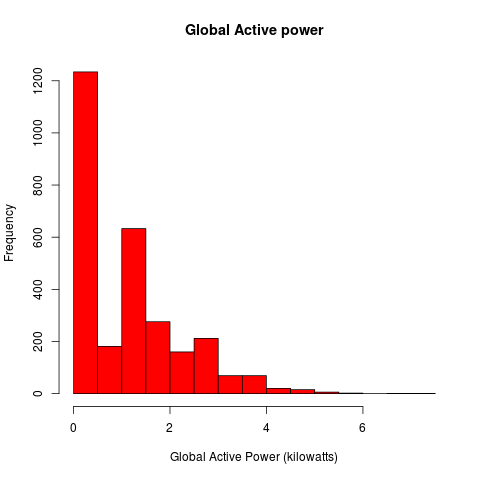

## Assumptions

I have put code for generating images with default background and transparent background. The transparency code is commented out. The ones with transparent background are of size 504 x 504 to get close to images provided. I think on some systems this would create a bit depth which would match the provided images exactly.

In this readme file you can see the three different images and see that they are hard to tell apart visually. The first image is from my code. The second image is from my commented out code for generating images with transparent background. The third image is the one provided by the staff.

Dataset: [Electric power consumption](https://d396qusza40orc.cloudfront.net/exdata%2Fdata%2Fhousehold_power_consumption.zip)

As the data set is large and I prefer to keep the data file in a compressed format. I unzipped the file and then compressed it using gzip command.
I kept the file in the gzip format as there are native R functions which can read from the gzip format. I find this format easy to work with especially
when I am dealing with large files. There may be ways to work directly with zip files but I am not familar with them.

Here is the code to do that. I assume that this gzipped data file is available in the working directory.

```
wget https://d396qusza40orc.cloudfront.net/exdata%2Fdata%2Fhousehold_power_consumption.zip
unzip exdata%2Fdata%2Fhousehold_power_consumption.zip
rm exdata%2Fdata%2Fhousehold_power_consumption.zip
gzip household_power_consumption.txt
```

## Background

This code is for the project 1 of [Exploratory Data Analysis](https://class.coursera.org/exdata-002/).
More details about the project can be found at the following GitHub repository: [https://github.com/rdpeng/ExData_Plotting1](https://github.com/rdpeng/ExData_Plotting1)

## Steps to recreate the images

```
R CMD BATCH plot1.R
R CMD BATCH plot2.R
R CMD BATCH plot3.R
R CMD BATCH plot4.R
```

Outputs: plot1.png, plot2.png, plot3.png, plot4.png
Outputs if transparency code is uncommented: plot1.png, plot1-T.png, plot2.png, plot2-T.png, plot3.png, plot3-T.png, plot4.png, plot4-T.png.

## My Plot 1


## My Plot 1 Transparent


## Reference Plot 1 from assignment
 


## My Plot 2


## My Plot 2 Transparent


## Reference Plot 2 from assignment
 


## My Plot 3


## My Plot 3 Transparent


## Reference Plot 3 from assignment
 


## My Plot 4


## My Plot 4 Transparent


## Reference Plot 4 from assignment

