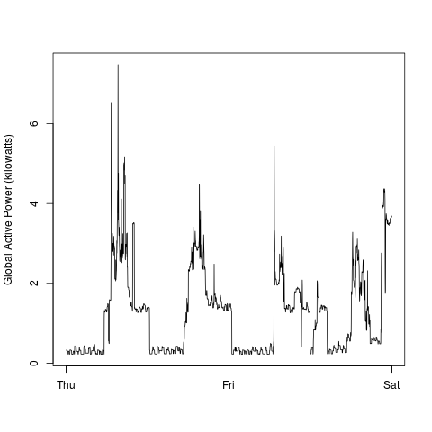
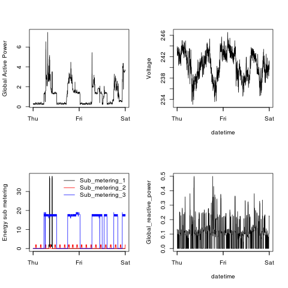

## Comments

I have put code for generating images with default background and
transparent background. The ones with transparent background are of 
size 504 x 504 to get close to images provided. I think on some systems this
would create a bit depth which would match the provided images exactly.

## Background

This code is for the project 1 of [Exploratory Data Analysis](https://class.coursera.org/exdata-002/).
More details about the project can be found at the following GitHub repository: [https://github.com/rdpeng/ExData_Plotting1](https://github.com/rdpeng/ExData_Plotting1)

## Code to generate the images

```
R CMD BATCH plot1.R
R CMD BATCH plot2.R
R CMD BATCH plot3.R
R CMD BATCH plot4.R
```

Outputs plot1.png, plot1-T.png, plot2.png, plot2-T.png, plot3.png, plot3-T.png, plot4.png, plot4-T.png

## My Plot 1


## My Plot 1 Transparent


## Reference Plot 1 from assignment
 


## My Plot 2


## My Plot 2 Transparent


## Reference Plot 2 from assignment
 


## My Plot 3


## My Plot 3 Transparent


## Reference Plot 3 from assignment
 


## My Plot 4


## My Plot 4 Transparent


## Reference Plot 4 from assignment

